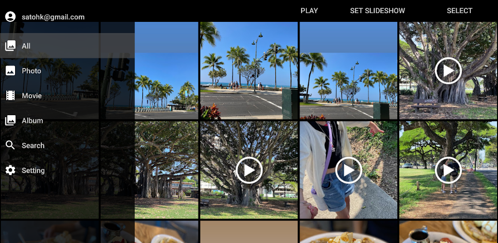

# fjphoto

fjphoto is a simple photo frame app for android devices such as tablets and TVs.

## Features
- Displays photos and videos from google photos.
- Slideshow functionality.
- Various search functions including AI-based similar image search.
- Simple and easy-to-use UI

## How this app use your personal data
- This app uses photos, videos and album information from Google photos.
- These data are only used on the device where the app is installed and are not sent to other devices such as servers on the internet.

## License
- [Licene](https://github.com/satohk/fjphoto/blob/main/LICENSE)
- [Privacy policy](./privacy_policy)
- [Terms & Conditions](./terms_and_conditions)

## Contact Us

If you have any questions or suggestions about the application, do not hesitate to contact me at satohk@gmail.com.